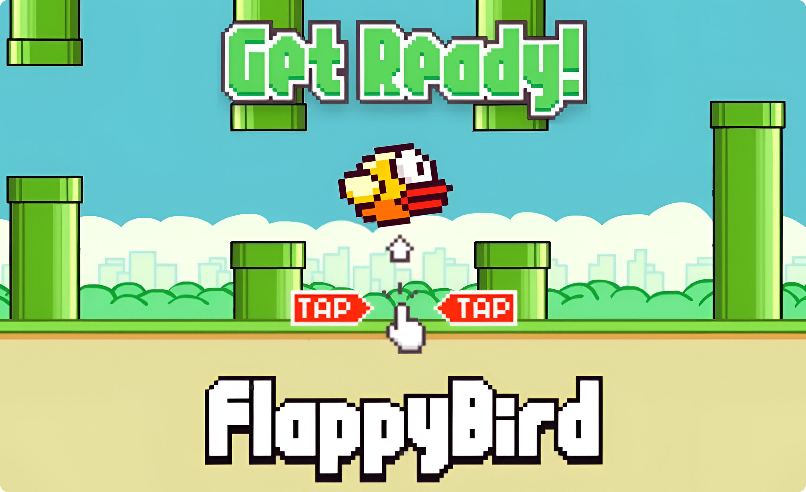

<p align="center">
  
</p>

<h1 style="display:flex; align-items:center; gap:12px; margin:0;">
  Flappy Bird
  
</h1>

This project recreates the classic arcade-style game Flappy Bird using Python and the Pygame game development library.<br>
It captures the original game’s simple yet addictive mechanics, allowing players to control a bird and guide it through a series of obstacles, aiming to survive as long as possible.

## Gameplay Preview
Below is a short preview of the gameplay, showcasing the bird navigating through narrow gaps between pipes. Players must carefully time each flap using the spacebar to stay airborne, as even a single collision with the obstacles or ground results in game over.

<p align="center">
  
</p>

## Controls
+ Spacebar  → Flap / Move Up  
+ ESC       → Restart Game  
+ Window Close → Exit Game

## Installation
Make sure Python 3 and pip are installed on your system.

#### Windows
```sh
git clone https://github.com/arinjadhav/flappy-bird.git
cd flappy-bird
pip install pygame
python main.py
```

#### MacOS
```sh
git clone https://github.com/arinjadhav/flappy-bird.git
cd flappy-bird
pip3 install pygame
python3 main.py
